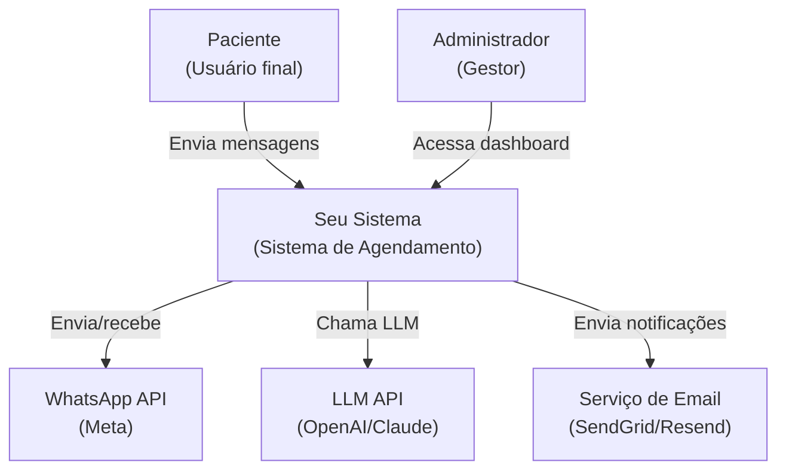
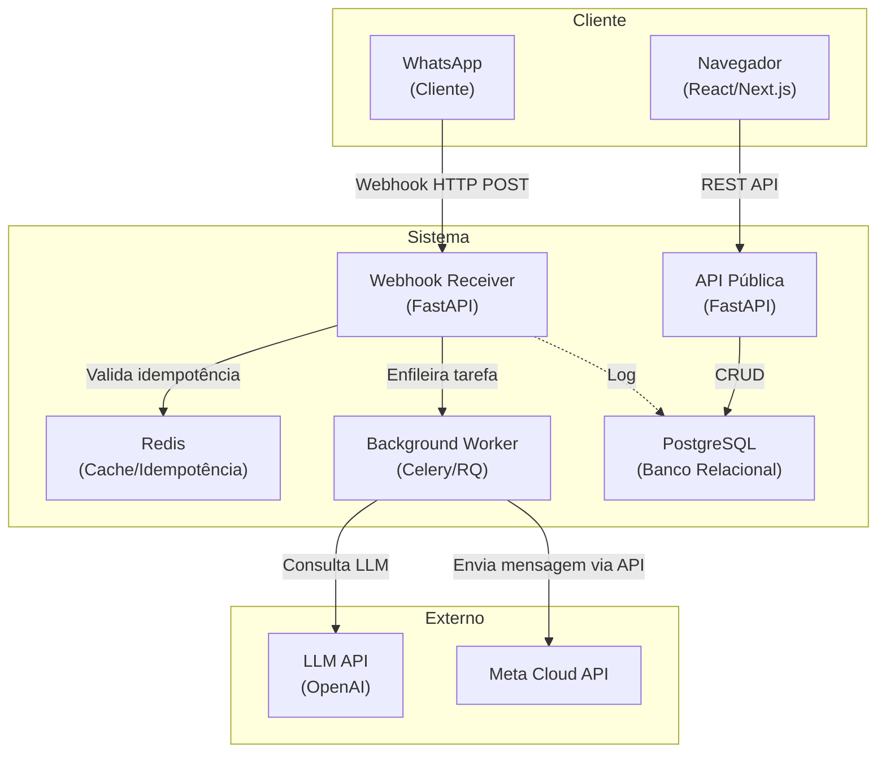
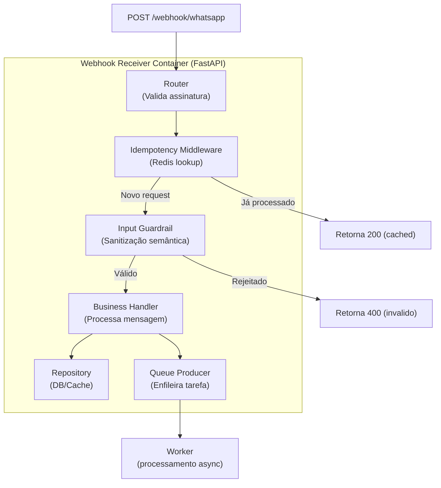
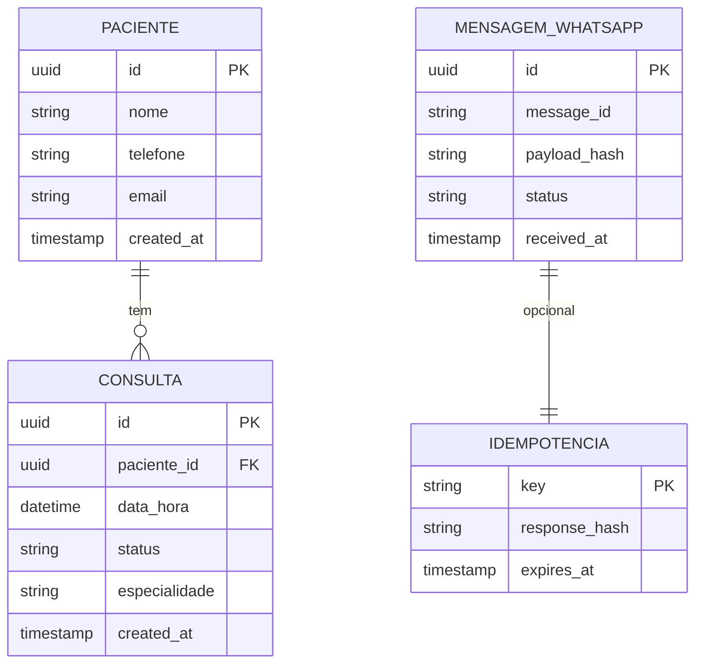

# Templates para Diagramas C4 (Mermaid)

Use estes templates durante a etapa **2. Define C4 Model (3 Levels)** da Skill 3. Eles fornecem estrutura de diagramas Mermaid validáveis e exemplos adaptáveis.

---

## Nível 1 – Diagrama de Contexto

Mostra o sistema como uma caixa preta, seus atores (personas) e sistemas externos.

**Instruções para preencher:**
- Substitua os nomes dos atores pelas personas reais do PRD.
- Liste todos os sistemas externos obrigatórios (APIs, bancos externos, serviços de terceiros).
- As setas devem descrever a direção e o propósito (ex: "Envia mensagens", "Consulta agenda").

---

## Nível 2 – Diagrama de Contêineres

Mostra os principais contêineres (aplicações, bancos, caches) e como se comunicam.

**Instruções:**
- Use `subgraph` para agrupar atores, sistema e externos.
- Inclua contêineres obrigatórios: webhook receiver (se houver entrada externa), API, worker assíncrono, cache (Redis), banco de dados.
- Mostre dependências de dados (ex: worker → Redis para lock/distributed queue).

---

## Nível 3 – Diagrama de Componentes (para o Contêiner mais crítico)

Exemplo: Componentes internos do **Webhook Receiver**.

**Instruções:**
- Escolha o contêiner mais complexo (geralmente o que recebe dados externos).
- Descreva o fluxo: validação → idempotência → sanitização → lógica → persistência → fila.
- Inclua caminhos alternativos (cache hit, erro de validação).

---

## Diagrama Entidade-Relacionamento (DER) para modelagem de dados

**Instruções:**
- Use sintaxe `erDiagram` do Mermaid.
- Defina PK (chave primária), FK (chave estrangeira).
- Mostre relacionamentos: `||--o{` (um para muitos), `||--||` (um para um), `}o--o{` (muitos para muitos).
- Inclua tabelas para idempotência e logs, se aplicável.

---

## Validação de sintaxe Mermaid

Antes de incluir no documento final, verifique:
- [ ] Nenhum caractere especial não escapado (ex: `:` dentro de texto substitua por `:` literal ou use `#lt;`).
- [ ] Labels com espaços devem estar entre aspas duplas.
- [ ] Setas com texto: `-->|texto|` ou `-- texto -->`.
- [ ] Subgraphs bem fechados com `end`.

> Estes templates são **referências**. A skill deve adaptar nomes, contêineres e componentes de acordo com o PRD e Dossiê.