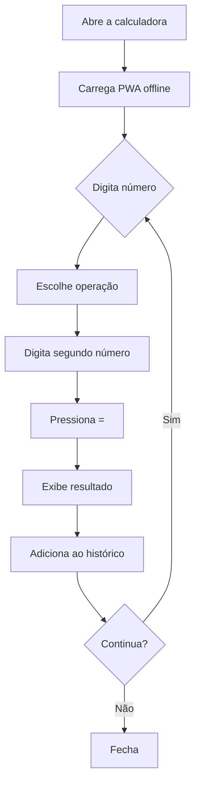

# Simulação: Calculadora Online — Framework NoCode StartUp AI

> Projeto hipotético de uma calculadora web simples, simulando como o AGENTE e o founder interagem usando o framework.

---

## 📋 Visão Geral do Projeto

| Campo | Valor |
|-------|-------|
| **Ideia** | Calculadora científica online gratuita |
| **Founder** | Não-técnico, quer MVP em 2 semanas |
| **Modelo alvo** | Claude Free (200k tokens de contexto) |
| **MVP** | 4 features → Step 0 é OPCIONAL (≤ 5 features) |

---

## FASE 1 — PLANEJAMENTO (Etapas 1 a 5)

### Etapa 1 — Visão Estratégica

**AGENTE pergunta:**

> "Qual problema específico sua calculadora resolve que as outras não resolvem?"

**Founder responde:**

> "Calculadoras online existentes são cheias de anúncios e lentas. Quero uma calculadora científica limpa, rápida, que funcione offline como PWA."

**AGENTE documenta no Documento Padrão:**

```markdown
## 1. Estratégia: Calculadora Científica Limpa

- **Problema**: Calculadoras online têm anúncios intrusivos e não funcionam offline
- **Público-alvo**: Estudantes (ensino médio/superior) que precisam de calculadora científica rápida
- **Métrica de sucesso**: 100 usuários/semana no primeiro mês
- **Escopo MVP**: Operações básicas + científicas, histórico, PWA offline
- **V2**: Temas, gráficos de funções, conversão de unidades
- **Orçamento**: $0/mês (Vercel Free + GitHub Pages)
```

**Exit Criteria** ✅ — problema claro, público definido, métrica com valor alvo.

---

### Etapa 2 — Market Insights

**AGENTE pesquisa e documenta:**

| Concorrente | Força | Fraqueza |
|-------------|-------|----------|
| Desmos | Gráficos poderosos | Pesado, lento para carregar |
| Calculator.net | Simples, muitas variações | Anúncios, feio |
| Google Calculator | Rápido, integrado | Só básico, sem histórico |

**Diferencial defensável**: PWA offline — nenhum concorrente oferece calculadora científica que funciona sem internet.

**Entrevistas simuladas** (fallback — founder não conseguiu entrevistas reais):

> **Persona 1 — Maria (19 anos, estudante de engenharia)**
> - Dor: "Preciso de calculadora científica na faculdade, mas o celular não tem espaço para apps"
> - Hoje usa: Calculadora do celular (básica) + Google
> - Pagaria? "Não, mas usaria se fosse boa e de graça"

> **Persona 2 — João (24 anos, concurseiro)**
> - Dor: "Faço questões de matemática no metrô, mas sem internet não funciona nada"
> - Hoje usa: Calculadora física velha
> - Pagaria? "Só se fosse realmente melhor"

**Exit Criteria** ✅ — 3 concorrentes mapeados, diferencial defensável, personas documentadas.

---

### Etapa 3 — Mapeamento de Processos

**Fluxo principal do usuário** (diagrama Mermaid):



**Estados**: Calculando → Exibindo resultado → Histórico → Offline

**Triggers**: Clique nos botões, teclado (keydown), install prompt do PWA

**Exit Criteria** ✅ — fluxo principal mapeado com branch, trigger documentado.

---

### Etapa 4 — Arquitetura Técnica

**AGENTE pesquisa preços de LLM** e decide:

| Tarefa | Modelo | Custo |
|--------|--------|-------|
| Nenhuma (calculadora não usa LLM) | — | $0 |

> Calculadora é 100% lógica client-side. Sem API calls, sem custo de LLM.

**Stack definida:**

| Camada | Tecnologia | Justificativa |
|--------|-----------|---------------|
| Framework | Next.js (App Router) | SSG + PWA fácil |
| UI | Tailwind CSS | Rápido, responsivo |
| PWA | next-pwa | Offline com service worker |
| Matemática | mathjs | Biblioteca científica robusta |
| Deploy | Vercel Free | $0, integração nativa com Next.js |
| Storage | localStorage | Histórico persistente offline |

**Exit Criteria** ✅ — stack completa, modelo LLM desnecessário, justificativas claras.

---

### Etapa 5 — Modelagem de Dados

```
📦 localStorage
 ┣ 📄 calculadora:histórico  → JSON array de {expressão, resultado, timestamp}
 ┗ 📄 calculadora:config     → JSON {tema, precisãoDecimal, anguloModo}
```

Sem banco de dados — tudo offline no navegador.

**Exit Criteria** ✅ — entidades mapeadas, políticas de acesso (só o usuário vê seus dados), schema V1 simples.

---

## FASE 2 — EXECUÇÃO (Etapa 6)

### Step 0 — Decomposição de Features (executado pelo AGENTE)

**AGENTE analisa o Documento Padrão e extrai as features:**

```
Features do MVP:
1. display — tela da calculadora com input/output
2. operacoes-basicas — +, -, ×, ÷, =, C, CE
3. operacoes-cientificas — sen, cos, tan, log, √, π, exp
4. historico — lista de cálculos anteriores salvos
5. pwa-offline — service worker, install prompt, funcionar sem internet
```

**Orçamento de Contexto (heurísticas):**

| Feature | Arquivos/telas | Passos | Decisão |
|---------|---------------|--------|---------|
| display | 1 (componente React) | 3 | ✅ Direto |
| operacoes-basicas | 2 (componente + lógica) | 8 | ✅ Direto |
| operacoes-cientificas | 2 (estende básicas) | 5 | ✅ Direto |
| historico | 1 (componente + localStorage) | 4 | ✅ Direto |
| pwa-offline | 2 (config + service worker) | 6 | ✅ Direto |

**Resultado**: Nenhuma feature precisa de decomposição (todas ≤ 3 arquivos/telas e ≤ 15 passos).

**AGENTE cria a estrutura:**
```
projeto-calculadora/
├── docs/
│   ├── documento-padrao.md
│   ├── decision-log.md
│   ├── context/
│   │   └── global/
│   │       ├── stack.md
│   │       ├── rules.md
│   │       └── schema.md
│   ├── checklist-seguranca.md
│   └── prd.md
└── features/
    ├── display/feature.md
    ├── operacoes-basicas/feature.md
    ├── operacoes-cientificas/feature.md
    ├── historico/feature.md
    └── pwa-offline/feature.md
```

**Conteúdo de `docs/context/global/stack.md`** (criado pelo AGENTE):
```markdown
# Stack — Calculadora Científica

- **Framework**: Next.js 15 (App Router), SSG
- **UI**: Tailwind CSS v4
- **PWA**: next-pwa
- **Matemática**: mathjs
- **Deploy**: Vercel Free
- **Storage**: localStorage (não tem banco)

## Regras
- Todo componente em `src/components/`
- Toda lógica matemática em `src/lib/`
- Testes em `src/__tests__/`
- Nome de classes: Tailwind utility-first
- Estado: React useState (sem estado global — calculadora não precisa)
```

**Exemplo de `features/display/feature.md`** (criado pelo AGENTE):
```markdown
# Feature: Display

## 📋 Objetivo
Tela principal da calculadora que mostra input (expressão digitada) e output (resultado).

## ✅ Critérios de Aceitação
- [ ] Input mostra números e operadores conforme digitados
- [ ] Output mostra resultado quando = é pressionado
- [ ] Fonte monoespaçada grande e legível
- [ ] Responsivo (mobile e desktop)
- [ ] Animação sutil ao mudar resultado

## 🧩 Contexto Relevante

### Stack usada
- Next.js 15 App Router, Tailwind CSS
- localStorage para histórico

### Regras de Negócio
- Input: linha superior, fonte menor (texto cinza)
- Output: linha inferior, fonte maior (texto preto/branco)
- Máximo 15 caracteres no input antes de reduzir fonte
- Resultados > 10 dígitos usam notação científica

## 📝 Plano de Execução

### 1. Criar componente Display
- **Arquivos**: `src/components/Display.tsx`
- **Fazer**: Input (expressão) + Output (resultado), responsivo, acessível
- **Verificar**: `npm run dev` e inspecionar visualmente

### 2. Estilizar com Tailwind
- **Arquivos**: `src/components/Display.tsx`
- **Fazer**: Fundo escuro, texto claro, fonte monoespaçada, transição suave
- **Verificar**: Testar em mobile viewport (375px)

## 🔗 Dependências
- Nenhuma (pode ser desenvolvida primeiro)

## 📊 Estimativa de Contexto
- **Arquivos/telas**: 1 | ✅ ≤ 3
- **Passos**: 3 | ✅ ≤ 15
- **Decisão**: ✅ Direto
```

---

### Passo 1 — Setup do Projeto

**AGENTE executa:**
```bash
npx create-next-app@latest projeto-calculadora --typescript --tailwind --app --src-dir
cd projeto-calculadora
npm install mathjs next-pwa
```

---

### Sprint 1 — Display + Operações Básicas

> Seguindo `features/display/feature.md` e `features/operacoes-basicas/feature.md`

**AGENTE lê `feature.md` do display, implementa, testa visualmente.**

**AGENTE lê `feature.md` das operações básicas e implementa:**

```typescript
// src/lib/calculadora.ts
import { evaluate, sqrt, pow, log, sin, cos, tan, pi, exp } from 'mathjs'

export function calcular(expressao: string): string {
  try {
    const resultado = evaluate(expressao)
    if (resultado === undefined || resultado === null) return 'Erro'
    if (typeof resultado === 'number') {
      if (Math.abs(resultado) > 999999999) return resultado.toExponential(4)
      return String(parseFloat(resultado.toFixed(10)))
    }
    return String(resultado)
  } catch {
    return 'Erro'
  }
}
```

**Verificação**: `npm run build` — zero erros.

---

### Sprint 2 — Operações Científicas + Histórico

> Seguindo `features/operacoes-cientificas/feature.md` e `features/historico/feature.md`

**AGENTE implementa interface de teclado científico (sen, cos, tan, log, √, π, exp).**

**AGENTE implementa histórico com localStorage:**

```typescript
// src/lib/historico.ts
interface Entry {
  expressao: string
  resultado: string
  timestamp: number
}

const KEY = 'calculadora:historico'

export function salvar(expressao: string, resultado: string): void {
  const historico = listar()
  historico.unshift({ expressao, resultado, timestamp: Date.now() })
  localStorage.setItem(KEY, JSON.stringify(historico.slice(0, 50))) // max 50
}

export function listar(): Entry[] {
  try {
    return JSON.parse(localStorage.getItem(KEY) || '[]')
  } catch {
    return []
  }
}

export function limpar(): void {
  localStorage.removeItem(KEY)
}
```

**Verificação**: Build + teste manual no navegador.

---

### Sprint 3 — PWA Offline

> Seguindo `features/pwa-offline/feature.md`

**AGENTE configura next-pwa para gerar service worker e manifest.**

**Verificação**: `npm run build && npm start` — testar com DevTools > Network > Offline.

---

### Revisão de Consistência

**AGENTE verifica:**
- ✅ Display e operações usam a mesma interface
- ✅ Histórico salva e exibe corretamente
- ✅ PWA offline serve todos os assets
- ✅ Nenhum nome de campo conflita entre features
- ✅ O resultado final parece um produto coeso, não features isoladas

---

### Checklist de Segurança

| # | Item | Status |
|---|------|--------|
| 1 | Variáveis de ambiente | ✅ Nenhuma chave necessária |
| 2 | Escopos de API | ✅ Sem APIs externas |
| 3 | Rate limiting | ✅ Sem endpoints |
| 4 | Logs seguros | ✅ Sem logs |
| 5 | Prompt segurança | ✅ Sem agente LLM |
| 6 | Headers HTTP | ✅ next.config.js com CSP |
| 7 | Validação de input | ✅ mathjs trata entradas inválidas |
| 8 | RLS | ✅ Sem banco de dados |
| 9 | Dependências | ✅ npm audit ok |
| 10 | Rollback | ✅ git tag v0.1.0 |

---

### PRD Gerado

```markdown
# Product Reference Document — Calculadora Científica

## O que foi construído
Calculadora científica web com PWA offline, histórico local e interface responsiva.

## Tech Stack
Next.js 15 + Tailwind CSS + mathjs + next-pwa

## Features implementadas
1. Display com input/output animado
2. Operações básicas (+, -, ×, ÷)
3. Operações científicas (sen, cos, tan, log, √, π, exp)
4. Histórico com localStorage (últimos 50 cálculos)
5. PWA offline (service worker + manifest)

## Decisões técnicas
- mathjs para segurança (evaluate sanitizado, sem eval())
- localStorage em vez de banco (offline-first, sem servidor)
- SSG (static generation) para carregamento instantâneo
```

---

## Etapa 7 — Lançamento

**AGENTE faz deploy na Vercel:**
```bash
npx vercel --prod
```

**Resultado**: `https://calculadora-cientifica.vercel.app`

**Métricas pós-lançamento**: Founder monitora Vercel Analytics para contar visitantes.

---

## Resumo da Simulação

| Etapa | O que o Founder Fez | O que o AGENTE Fez |
|-------|-------------------|--------------------|
| 1 | Respondeu 5 perguntas | Documentou visão, métricas, escopo |
| 2 | Validou personas | Pesquisou concorrentes, criou SWOT |
| 3 | Descreveu o fluxo | Gerou diagrama Mermaid |
| 4 | Aprovou stack | Pesquisou preços, escolheu tecnologias |
| 5 | Validou schema | Modelou dados (localStorage) |
| 6 (Step 0) | — | Decompôs features, criou `feature.md` por feature |
| 6 (Setup) | — | Scaffold do projeto |
| 6 (Sprints) | — | Codificou 5 features em 3 sprints |
| 6 (Revisão) | — | Verificou consistência entre features |
| 6 (Segurança) | Aprovou checklist | Executou checklist |
| 7 | Acompanhou métricas | Fez deploy, gerou PRD |

**Tempo total estimado**: 3-4 horas de interação founder + AGENTE. Founder só respondeu perguntas e aprovou decisões — o AGENTE fez todo o resto.
