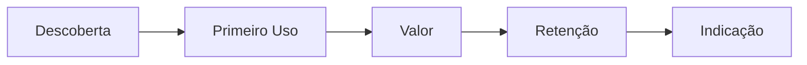

# Documento Padrão — [Nome do Projeto]

> Gerado pelo Framework NoCode StartUp AI — Vibe Coding Edition
> Criado em: [YYYY-MM-DD] | Última atualização: [YYYY-MM-DD]

---

## 1. Estratégia: [objetivo]

### Problema
[Descrição da dor em 1 frase]

### Público-alvo
[Quem sente essa dor?]

### Objetivo do MVP
[Hipótese única que queremos provar]

### Métricas de Sucesso
| Métrica | Alvo | Prazo |
|---------|------|-------|
| [ex: Adoção] | [ex: 100 usuários] | [ex: 30 dias] |
| [ex: Conversão] | [ex: 5%] | [ex: 30 dias] |

### Escopo
| MVP (agora) | V2 (próximo) | Nunca |
|-------------|--------------|-------|
| [funcionalidade core] | [melhoria] | [fora do propósito] |

### Orçamento
| Recurso | Custo/mês | Free Tier? |
|---------|-----------|:----------:|
| [ex: Supabase] | $0 | ✅ |
| [ex: API LLM] | $20 | ❌ |

---

## 2. Mercado: [insights]

### Concorrentes
| Concorrente | O que fazem | Falha | Nosso Diferencial |
|-------------|-------------|-------|-------------------|
| [Nome] | [resumo] | [o que falta] | [como somos melhores] |

### Validação com Usuários
**Método**: [entrevistas reais / personas com dados de mercado]
**Entrevistados/Personas**:
1. **[Nome]**: [dor principal] — "citação literal"
2. **[Nome]**: [dor principal] — "citação literal"

**Padrões identificados**:
- [padrão 1]
- [padrão 2]

**Disposição a pagar**: R$[valor]/mês

### Análise SWOT
| Forças | Fraquezas |
|--------|-----------|
| [força 1] | [fraqueza 1] |
| [força 2] | [fraqueza 2] |

| Oportunidades | Ameaças |
|---------------|---------|
| [oportunidade 1] | [ameaça 1] |

### UX Patterns de Referência
- **Inspiração**: [links]
- **Paleta**: [cores]
- **Tipografia**: [fontes]
- **Padrões de navegação**: [descrição]

---

## 3. Fluxo: [diagrama]

### Jornada do Usuário


### Árvore de Decisão
```
SE [condição] → [ação]
SENÃO → [outra ação]
```

### Triggers
| Evento | Ação | Fonte |
|--------|------|-------|
| [trigger] | [ação] | [webhook/email/usuário] |

### Board States
```
New Lead → In Service → Awaiting → Completed → Archived
```

---

## 4. Stack: [decisões]

| Camada | Escolha | Justificativa |
|--------|---------|---------------|
| Interface | [Next.js / Expo / Chat] | [por que] |
| LLM | [Claude / GPT / Gemini] | [por que — ver tabela de custos abaixo] |
| Provider | [Antrophic / OpenAI / Google] | [por que] |
| LLM alternativo (fallback) | [modelo mais barato] | [custa X% menos, performance Y%] |

### Tabela de Custos de LLM (pesquisado em [data])

**Tarefa: Classificação/Extração**
| Modelo | Provider | $ Input (1M tok) | $ Output (1M tok) | Performance |
|--------|----------|:----------------:|:-----------------:|:-----------:|
| [modelo] | [provider] | $X.XX | $X.XX | [benchmark] |
| [modelo] | [provider] | $X.XX | $X.XX | [benchmark] |

**Tarefa: Conversação/Geração**
| Modelo | Provider | $ Input (1M tok) | $ Output (1M tok) | Performance |
|--------|----------|:----------------:|:-----------------:|:-----------:|
| [modelo] | [provider] | $X.XX | $X.XX | [benchmark] |
| [modelo] | [provider] | $X.XX | $X.XX | [benchmark] |

**Estratégia de fallback**: Se [modelo caro] exceder orçamento, cair para [modelo barato]
**Hard cap mensal**: $X.XX/mês
**Custo mensal estimado**: $X.XX (baseado em [X] conversas/dia × [Y] turns × [Z] tokens)
| Banco | [Supabase / Neon / MongoDB] | [por que] |
| Memória curto prazo | [Redis / Upstash] | [por que] |
| Vetor (RAG) | [pgvector / Pinecone] | [por que] |
| Deploy | [Vercel / Railway / Render] | [por que] |

### Tools/MCP
| Integração | Tipo | Finalidade |
|------------|------|------------|
| [API] | GET | [consulta] |
| [API] | POST | [ação] |

### Anotações de Prompt
```
Tom: [ex: profissional mas acolhedor]
Limites: [o que o agente NÃO deve fazer]
Formato de resposta: [ex: markdown, JSON]
```

---

## 5. Schema: [modelagem]

### Tabelas
```sql
-- Exemplo
CREATE TABLE users (
    id UUID PRIMARY KEY DEFAULT gen_random_uuid(),
    email TEXT UNIQUE NOT NULL,
    name TEXT NOT NULL,
    created_at TIMESTAMPTZ DEFAULT NOW()
);
```

### Relações
| De | Para | Tipo | Descrição |
|----|------|------|-----------|
| users | subscriptions | 1:1 | cada user tem 1 subscription |

### RLS Policies
| Tabela | Operação | Policy |
|--------|----------|--------|
| users | SELECT | próprio usuário ou admin |
| [tabela] | INSERT | usuário autenticado |

---

## 6. MVP: [build]

### Estrutura do Projeto
```
[tree do projeto]
```

### Funcionalidades Entregues
- [ ] Autenticação (login/signup)
- [ ] [funcionalidade core]
- [ ] [funcionalidade secundária]
- [ ] Tratamento de erros
- [ ] UI responsiva

### Checklist de Segurança
✅ [ver docs/checklist-seguranca.md]

### PRD
📄 [ver docs/prd.md]

---

## 7. Deploy: [métricas + ciclo]

### URL de Produção
[https://projeto.vercel.app](https://projeto.vercel.app)

### Métricas Coletadas vs. Alvos
| Métrica | Alvo | Real | Status |
|---------|------|------|--------|
| [métrica] | [valor] | [valor] | ✅/❌ |

### Feedback de Usuários
1. [feedback 1]
2. [feedback 2]

### Próximo Ciclo (PDCA)
| Plan | Do | Check | Act |
|------|----|-------|-----|
| [o que melhorar] | [implementar] | [métrica melhorou?] | [pivot/persevere/scale] |

### Decisão Final
- [ ] **Pivot**: mudar direção
- [ ] **Persevere**: continuar iterando
- [ ] **Scale**: buscar investimento
